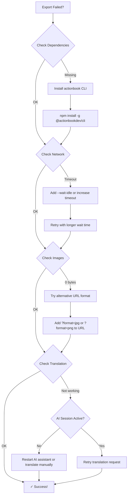

# Troubleshooting Guide

Comprehensive troubleshooting guide for common issues when exporting articles to Obsidian.

---

## 🔍 Quick Diagnosis Flow



---

## 📋 Quick Checklist

Before troubleshooting, run through this checklist:

```bash
# 1. Check dependencies
actionbook --version
# Should output: actionbook 0.x.x

# 2. Test network
curl -I https://example.com
# Should return HTTP/1.1 200 OK

# 3. Check disk space
df -h | grep /Users
# Ensure > 1GB available

# 4. Verify permissions
ls -l ~/Work/Write/Articles
# Should show drwxr-xr-x
```

---

## Common Issues

### Issue 1: "actionbook: command not found"

**Symptoms**:
```bash
$ actionbook --version
-bash: actionbook: command not found
```

**Cause**: actionbook CLI not installed or not in PATH

**Solutions**:

**Solution A**: Install actionbook CLI globally
```bash
npm install -g @actionbookdev/cli

# Verify installation
actionbook --version
# Should show: actionbook 0.8.x or higher
```

**Solution B**: Check npm global path
```bash
# Check if npm global bin is in PATH
npm bin -g
# Example output: /usr/local/lib/node_modules/.bin

# Add to PATH if needed (add to ~/.bashrc or ~/.zshrc)
export PATH="$(npm bin -g):$PATH"

# Reload shell
source ~/.bashrc  # or source ~/.zshrc
```

**Solution C**: Use npx (no installation required)
```bash
# Use npx to run without global install
npx @actionbookdev/cli browser fetch <url> --format markdown
```

---

### Issue 2: Permission Denied When Installing CLI

**Symptoms**:
```bash
$ npm install -g @actionbookdev/cli
Error: EACCES: permission denied
```

**Cause**: Need sudo for global npm install OR npm prefix not configured

**Solutions**:

**Solution A**: Use sudo (quick fix)
```bash
sudo npm install -g @actionbookdev/cli
```

**Solution B**: Configure npm prefix (recommended)
```bash
# Create npm directory in home
mkdir -p ~/.npm-global

# Configure npm to use new directory
npm config set prefix ~/.npm-global

# Add to PATH (add to ~/.bashrc or ~/.zshrc)
export PATH=~/.npm-global/bin:$PATH

# Reload shell
source ~/.bashrc  # or source ~/.zshrc

# Install without sudo
npm install -g @actionbookdev/cli
```

---

### Issue 3: Images Downloading as 0 Bytes

**Symptoms**:
```bash
$ ls -lh images/
-rw-r--r--  1 user  staff     0B  image_1.jpg  ← Problem!
-rw-r--r--  1 user  staff     0B  image_2.jpg
```

**Cause**:
- Image URL expired or changed
- Network issue or rate limiting
- Incorrect URL format

**Solutions**:

**Solution A**: Try alternative URL formats
```bash
# Original URL fails
curl "$url" -o image.jpg  # 0 bytes

# Try JPG format parameter
curl "${url}?format=jpg&name=orig" -o image.jpg

# Try PNG format
curl "${url}?format=png&name=orig" -o image.png

# Try with user-agent header
curl -A "Mozilla/5.0" "$url" -o image.jpg
```

**Solution B**: Manual download test
```bash
# Test image URL manually
curl -I "$IMAGE_URL"
# Check response: should be 200 OK, not 403/404

# If 403, add headers
curl -H "Referer: $ARTICLE_URL" "$IMAGE_URL" -o test.jpg

# If 404, image may be deleted from source
```

**Solution C**: Check rate limiting
```bash
# Add delay between downloads
for url in $IMAGE_URLS; do
    curl "$url" -o "image_${counter}.jpg"
    sleep 2  # Wait 2 seconds between requests
    counter=$((counter + 1))
done
```

---

### Issue 4: Translation Not Working

**Symptoms**:
- AI assistant doesn't translate after export
- Translation output is incomplete
- Translation fails silently

**Causes**:
- AI session inactive or expired
- File path incorrect
- Translation prompt unclear

**Solutions**:

**Solution A**: Retry translation explicitly
```
User: Please translate the file at ~/Work/Write/Articles/<title>/README.md
      to Chinese and save as README_CN.md
```

**Solution B**: Break down translation request
```
User:
1. Read the file: ~/Work/Write/Articles/<title>/README.md
2. Translate it to Chinese (中文)
3. Save translation to: ~/Work/Write/Articles/<title>/README_CN.md
```

**Solution C**: Manual translation
```
User: Show me the content of README.md first, then translate
```

**Solution D**: Check file exists
```bash
# Verify README.md exists
ls -lh ~/Work/Write/Articles/<title>/README.md
# Should show file size > 0
```

---

### Issue 5: Fetch Timeout

**Symptoms**:
```bash
$ actionbook browser fetch <url> --format markdown --wait-idle
[Hangs for >30 seconds]
^C  # User cancels
```

**Cause**:
- Slow website
- Network issue
- Page requires authentication
- JavaScript-heavy site not fully loading

**Solutions**:

**Solution A**: Already using --wait-idle (good!)
```bash
# This is the correct approach
actionbook browser fetch <url> --format markdown --wait-idle
```

**Solution B**: Check if page requires login
```bash
# Some articles are behind paywall
# Try opening in browser first to verify access
open <url>  # macOS
xdg-open <url>  # Linux
```

**Solution C**: Try without --wait-idle (faster but may miss content)
```bash
# For simple static pages
actionbook browser fetch <url> --format markdown
```

**Solution D**: Use different network
```bash
# If on VPN, try disabling
# If on slow connection, try faster network
```

---

### Issue 6: Directory Already Exists

**Symptoms**:
```bash
mkdir: cannot create directory: File exists
```

**Cause**: Article was previously exported

**Solutions**:

**Solution A**: Overwrite existing directory
```bash
# Remove old directory first
rm -rf "$ARTICLE_DIR"

# Then re-create
mkdir -p "$ARTICLE_DIR/images"
```

**Solution B**: Use different output directory
```bash
# Add timestamp to directory name
ARTICLE_DIR="$OUTPUT_DIR/${SAFE_TITLE}-$(date +%Y%m%d)"
mkdir -p "$ARTICLE_DIR/images"
```

**Solution C**: Skip if already exists
```bash
if [ -d "$ARTICLE_DIR" ]; then
    echo "⚠️  Directory already exists, skipping..."
    exit 0
fi
```

---

### Issue 7: Special Characters in Title

**Symptoms**:
```bash
mkdir: invalid directory name: "How to Use <AI> | Guide"
```

**Cause**: Title contains invalid filename characters

**Solution**: Sanitize title (already in workflow)
```bash
# Remove invalid characters: / : * ? " < > |
SAFE_TITLE=$(echo "$TITLE" | sed 's/[/:*?"<>|]//g')

# Trim to 100 characters
SAFE_TITLE=$(echo "$SAFE_TITLE" | cut -c1-100)

# Trim whitespace
SAFE_TITLE=$(echo "$SAFE_TITLE" | sed 's/^[[:space:]]*//;s/[[:space:]]*$//')

# Result: "How to Use AI  Guide"
```

---

### Issue 8: Title Extraction Fails

**Symptoms**:
```bash
TITLE=""  # Empty title
```

**Cause**: Article doesn't have H1 heading, or format is unexpected

**Solutions**:

**Solution A**: Try alternative extraction
```bash
# Try H1 (preferred)
TITLE=$(grep -m 1 "^# " article.md | sed 's/^# //')

# If empty, try H2
if [ -z "$TITLE" ]; then
    TITLE=$(grep -m 1 "^## " article.md | sed 's/^## //')
fi

# If still empty, use filename
if [ -z "$TITLE" ]; then
    TITLE=$(basename "$URL" .html)
fi
```

**Solution B**: Manual title specification
```bash
# User provides title explicitly
TITLE="User Provided Title"
SAFE_TITLE=$(echo "$TITLE" | sed 's/[/:*?"<>|]//g' | cut -c1-100)
```

---

### Issue 9: No Images Found

**Symptoms**:
```bash
IMAGE_URLS=""  # Empty
echo "Images found: 0"
```

**Cause**: Article has no images, or image format is different

**Solutions**:

**Solution A**: Check if article actually has images
```bash
# Open article in browser
open "$URL"  # Verify images exist
```

**Solution B**: Try alternative image extraction
```bash
# Original pattern
IMAGE_URLS=$(grep -o '!\[[^]]*\]([^)]*)' article.md | sed -E 's/!\[[^]]*\]\(([^)]*)\)/\1/')

# Try HTML img tags (if markdown conversion missed images)
IMAGE_URLS=$(grep -o ']*src="[^"]*"' article.md | sed 's/.*src="\([^"]*\)".*/\1/')
```

**Solution C**: Skip image download gracefully
```bash
if [ -z "$IMAGE_URLS" ]; then
    echo "ℹ No images found in article, skipping image download..."
else
    # Download images
fi
```

---

### Issue 10: Disk Space Full

**Symptoms**:
```bash
mkdir: cannot create directory: No space left on device
```

**Cause**: Not enough disk space

**Solutions**:

**Solution A**: Check disk space
```bash
df -h | grep /Users
# Example output:
# /dev/disk1  500G  490G   10G  98%  ← Problem!
```

**Solution B**: Free up space
```bash
# Delete old exports
rm -rf ~/Work/Write/Articles/old-articles/

# Or use different output directory on larger disk
OUTPUT_DIR="/Volumes/ExternalDrive/Articles"
```

---

## Advanced Troubleshooting

### Enable Verbose Mode

Add verbose flags to actionbook commands:

```bash
# For actionbook (check CLI documentation for verbose flags)
actionbook browser fetch "$URL" --format markdown --wait-idle --verbose
```

### Check Logs

```bash
# Check actionbook logs (if available)
tail -f ~/.actionbook/logs/browser.log

# System logs (macOS)
log show --predicate 'process == "actionbook"' --last 5m
```

### Network Debugging

```bash
# Test connectivity
curl -v https://medium.com

# Check DNS resolution
nslookup medium.com

# Test with different DNS
# macOS: System Settings > Network > DNS
# Add 8.8.8.8 (Google DNS)
```

### File System Debugging

```bash
# Check permissions
ls -la ~/Work/Write/Articles/

# Check if path exists
test -d ~/Work/Write/Articles && echo "Exists" || echo "Not found"

# Create if missing
mkdir -p ~/Work/Write/Articles
```

---

## Getting Help

### Self-Service

1. **Run dependency check**: `actionbook --version`
2. **Check network**: `curl -I https://example.com`
3. **Verify disk space**: `df -h`
4. **Review SKILL.md**: See main workflow documentation

### Community Support

- **GitHub Issues**: https://github.com/actionbook/actionbook/issues
- **Discussions**: https://github.com/actionbook/actionbook/discussions

### Bug Reports

When reporting bugs, include:

```bash
# System information
uname -a
node --version
npm --version
actionbook --version

# Error output
actionbook browser fetch <url> --format markdown 2>&1 | tee error.log

# Disk space
df -h

# Network test
curl -I <url>
```

---

## Prevention Tips

### Before Export

1. ✅ Verify `actionbook` CLI is installed: `actionbook --version`
2. ✅ Check network connectivity: `curl -I https://example.com`
3. ✅ Verify disk space: `df -h` (ensure > 1GB available)
4. ✅ Test with simple URL first

### During Export

1. ✅ Monitor terminal output for errors
2. ✅ Check file sizes: `ls -lh $ARTICLE_DIR`
3. ✅ Verify image downloads: `ls -lh $ARTICLE_DIR/images/`

### After Export

1. ✅ Verify file sizes: `ls -lh $ARTICLE_DIR/`
2. ✅ Check image count: `ls $ARTICLE_DIR/images/ | wc -l`
3. ✅ Open in Obsidian to verify formatting

---

## FAQ

### Q: Can I export paywalled articles?

**A**: Only if you have access. If you're logged in to the service in your browser, `actionbook` should use that session. Otherwise, the article content will be limited.

### Q: Why are some images missing?

**A**: Images may be:
- Deleted from the source
- Hosted on different domains with CORS restrictions
- Using data: URLs (not downloadable)
- Behind authentication

**Solution**: Check the original article to verify images exist.

### Q: Can I export Twitter threads?

**A**: Currently only single tweets/articles are supported. Thread support is a future enhancement.

### Q: How do I export to PDF?

**A**: Export to Markdown first, then use Pandoc:
```bash
pandoc README.md -o article.pdf
```

Or use Obsidian's PDF export feature.

### Q: Can I customize the output format?

**A**: Yes, modify Step 7 in the workflow (Create Navigation Index) to customize the `index.md` template.

### Q: How do I handle very long articles?

**A**: The workflow handles articles of any length. If translation takes too long, you can:
1. Translate in sections
2. Use a faster AI model
3. Skip translation and translate manually later

---

**Last Updated**: 2026-03-12 | **Version**: 0.2.0
